# You-Web UI

[](https://badge.fury.io/js/@you-web%2Fui-core)
[](https://www.npmjs.com/package/@you-web/ui-core)
[](https://github.com/hourong88/You-Web-UI/blob/main/LICENSE)

🚀 基于 Vue 3 + TypeScript 的现代化 Web 组件库，专为 Vue 开发者打造

## ✨ 特性

- 🎯 **现代化技术栈**：基于 Vue 3 + TypeScript + Vite 构建
- 📱 **Web 优化**：专为现代 Web 应用优化，支持响应式设计
- 🎨 **轻量简洁**：组件设计简洁，体积小巧
- 🔧 **TypeScript**：完整的 TypeScript 类型支持
- 📖 **完善文档**：提供详细的组件文档和示例
- 🎪 **Storybook**：可视化组件展示和调试
- 🎨 **设计原则与价值观**：基于一致性、易用性、可扩展性的设计理念
- 🎯 **设计令牌驱动**：通过设计令牌确保视觉一致性和主题化能力
- ♿ **无障碍支持**：遵循 WCAG 2.1 标准，确保可访问性
- 🌍 **国际化就绪**：支持多语言和本地化
- 🎭 **主题化系统**：灵活的主题定制和品牌适配
- 🧩 **原子化设计**：基于原子设计理论，确保组件的组合性和复用性

## 🎉 项目背景

You-Web UI 不仅仅是一个组件库，更是一套完整的设计系统。我们的核心理念是：**设计系统是一套完整的设计原则、组件、模式和工具的集合，旨在确保产品在不同平台、不同场景下都能提供一致且高质量的用户体验，同时提高开发效率和协作效率。**

### 🎯 设计原则与价值观

我们的设计系统基于以下核心原则：

- **🎨 一致性 (Consistency)**：通过统一的设计语言和视觉规范，确保用户在不同场景下的体验一致性
- **⚡ 高效性 (Efficiency)**：提供开箱即用的组件和模式，显著提升开发效率
- **🎯 易用性 (Usability)**：注重用户体验，遵循直觉化的交互设计原则
- **🔧 可扩展性 (Scalability)**：灵活的架构设计，支持业务快速迭代和扩展
- **♿ 包容性 (Inclusivity)**：遵循无障碍设计标准，确保所有用户都能平等使用
- **🌱 可持续性 (Sustainability)**：考虑长期维护和演进，建立可持续的设计生态

### 🎨 设计令牌驱动

我们采用设计令牌 (Design Tokens) 作为设计系统的基础，它们是可编程的变量，定义了所有视觉元素：

- **🎨 颜色系统**：主色、辅助色、中性色、功能色的完整色彩体系
- **📝 字体系统**：字号、字重、行高的层次化排版规范
- **📏 间距系统**：内外边距、组件间距的统一规范
- **🔘 形状系统**：圆角、边框、阴影的一致性定义
- **🎬 动效系统**：过渡、动画的统一时间曲线和持续时间
- **🎯 图标系统**：统一的图标风格和使用规范

这些设计令牌确保了跨平台、跨技术栈的视觉一致性，同时支持灵活的主题定制。

## 📱 关注我们

扫码关注微信公众号，获取最新更新和技术分享：

<div align="center">
  
</div>

## 📦 安装

### NPM 安装

```bash
npm install @you-web/ui-core
# 或
pnpm add @you-web/ui-core
# 或
yarn add @you-web/ui-core
```

### CDN 引入

```html
<!-- 引入样式 -->
<link rel="stylesheet" href="https://unpkg.com/@you-web/ui-core/dist/style.css">
<!-- 引入组件库 -->
<script src="https://unpkg.com/@you-web/ui-core/dist/index.umd.js"></script>
```

> 💡 **提示**：其他开发者现在可以通过 `npm install @you-web/ui-core` 安装使用您的组件库！

## 🚀 快速开始

### 全局引入

```typescript
import { createApp } from 'vue'
import YouUI from '@you-web/ui-core'
import '@you-web/ui-core/dist/style.css'

const app = createApp(App)
app.use(YouUI)
```

### 按需引入

```typescript
import { YButton, YCard } from '@you-web/ui-core'
```

### 在模板中使用

```vue
<template>
  <YButton type="primary" @click="handleClick">点击按钮</YButton>
  <YCard title="卡片标题">
    <p>卡片内容</p>
  </YCard>
</template>
```

## 🎯 支持平台

- ✅ **现代浏览器**：完美支持 Chrome、Firefox、Safari、Edge 等主流浏览器
- ✅ **移动端浏览器**：支持移动端 H5 应用
- ✅ **Vue 3 应用**：专为 Vue 3 项目优化
- ✅ **TypeScript**：完整的类型支持

## 📋 组件清单

### ✅ 已完成组件

| 组件 | 说明 | 状态 |
|------|------|------|
| YButton | 按钮组件 | ✅ 已完成 |
| YCard | 卡片容器 | ✅ 已完成 |
| YCell | 单元格组件 | ✅ 已完成 |
| YIcon | 图标组件 | ✅ 已完成 |
| YInput | 输入框组件 | ✅ 已完成 |
| YList | 列表组件 | ✅ 已完成 |
| YLoading | 加载组件 | ✅ 已完成 |
| YSwipeAction | 滑动操作 | ✅ 已完成 |
| YTag | 标签组件 | ✅ 已完成 |
| YFooter | 页脚组件 | ✅ 已完成 |
| YGrid | 宫格组件 | ✅ 已完成 |
| YTips | 消息提示组件 | ✅ 已完成 |
| YSteps | 步骤条组件 | ✅ 已完成 |
| YDrawer | 抽屉组件 | ✅ 已完成 |
| YModal | 弹窗组件 | ✅ 已完成 |
| YTabs | 标签页组件 | ✅ 已完成 |
| YCountdown | 倒计时组件 | ✅ 已完成 |
| YToast | 消息提示组件 | ✅ 已完成 |
| YCascadeSelection | 级联选择器 | ✅ 已完成 |
| YRadio | 单选框组件 | ✅ 已完成 |
| YTextarea | 多行文本框组件 | ✅ 已完成 |

### 📸 组件预览

以下是组件在实际应用中的效果展示：

#### 组件页面总览
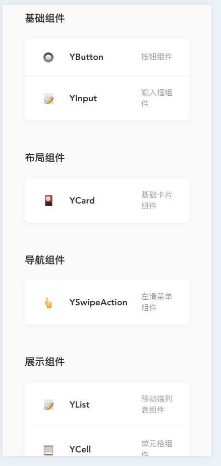

#### YCard 卡片组件
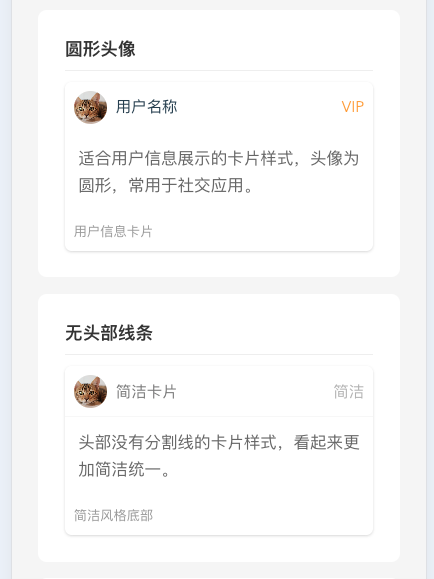

#### YCell 单元格组件
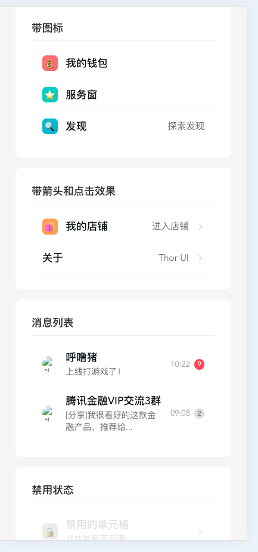

#### YInput 输入框组件
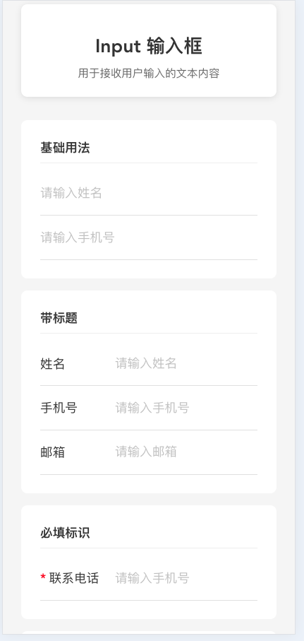

#### YLoading 加载组件
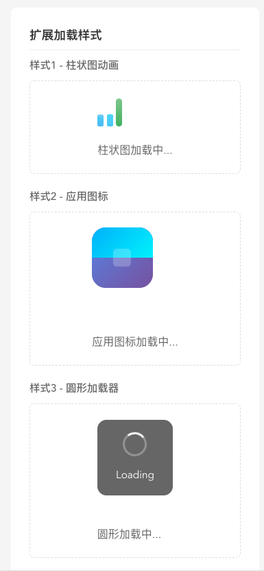

#### YIcon 图标组件
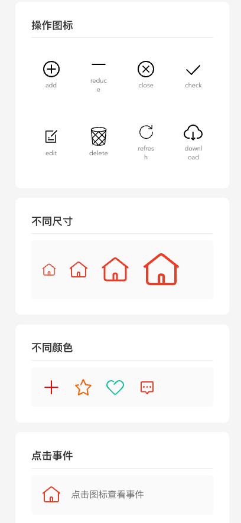

#### YSwipeAction 滑动操作组件
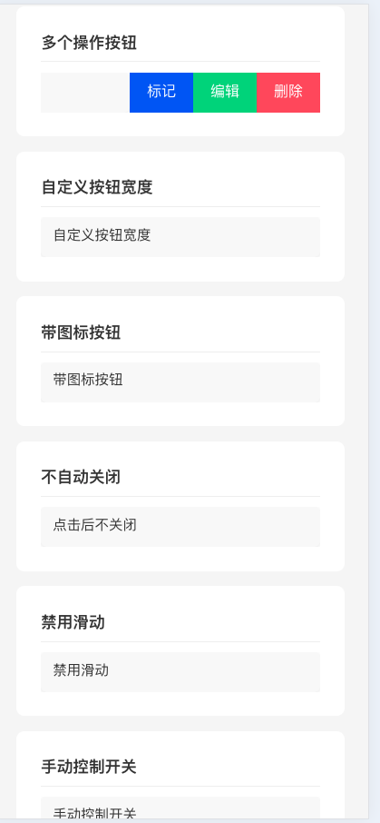

#### YTag 标签组件
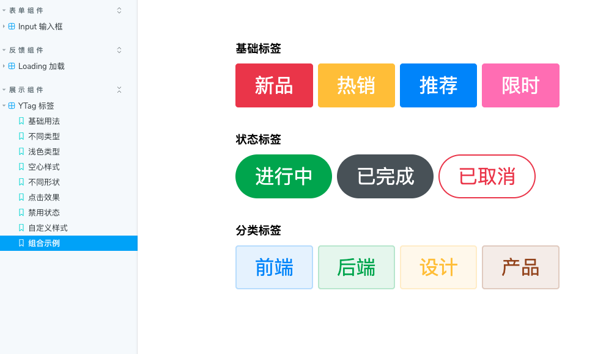

#### YFooter 页脚组件
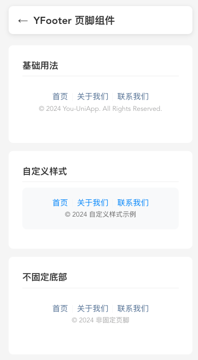

#### YGrid 宫格组件
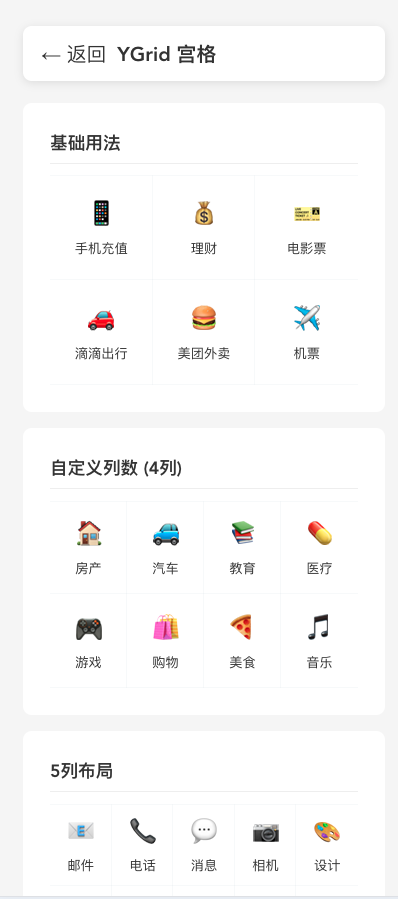

#### YTips 消息提示组件


#### YSteps 步骤条组件
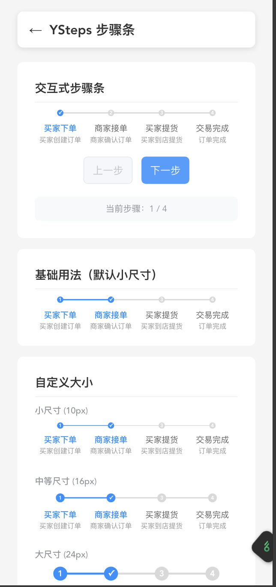

#### YDrawer 抽屉组件
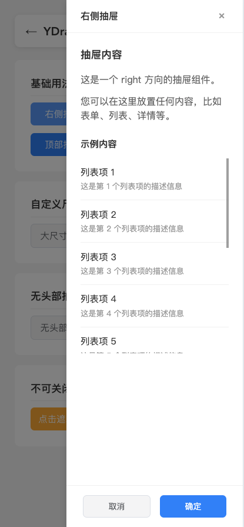

#### YModal 弹窗组件
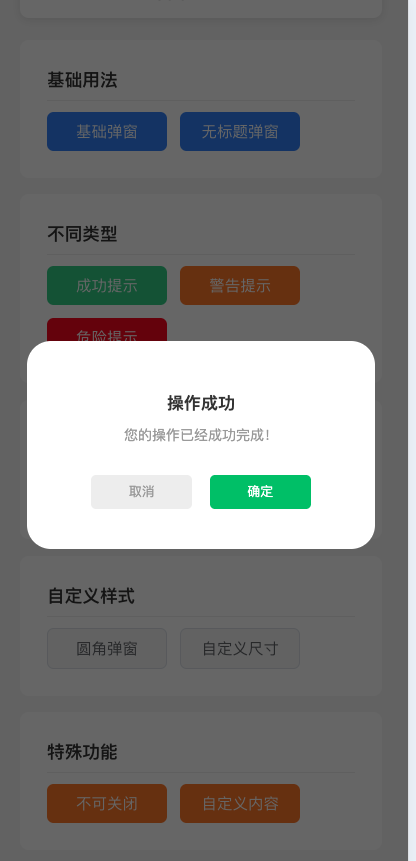

#### YTabs 标签页组件
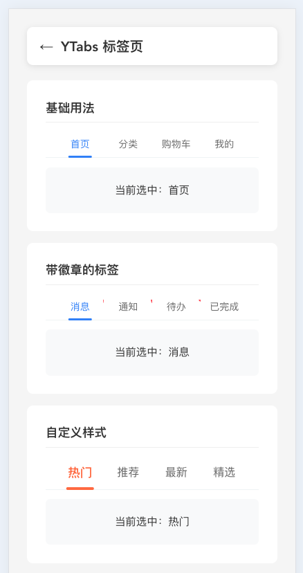

#### YCountdown 倒计时组件
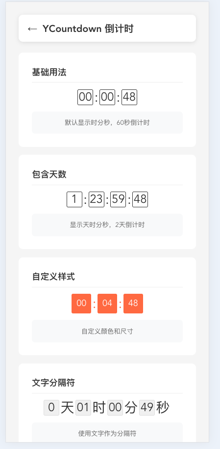

#### YCascadeSelection 级联选择器
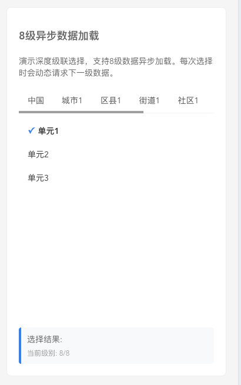

#### YRadio 单选框组件


#### YTextarea 多行文本框组件


#### 文档系统
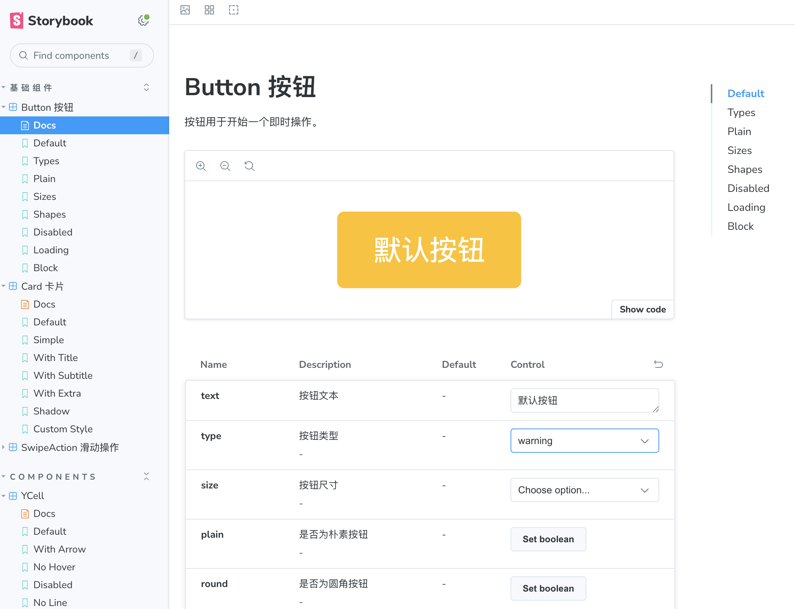

#### YIcon 组件文档
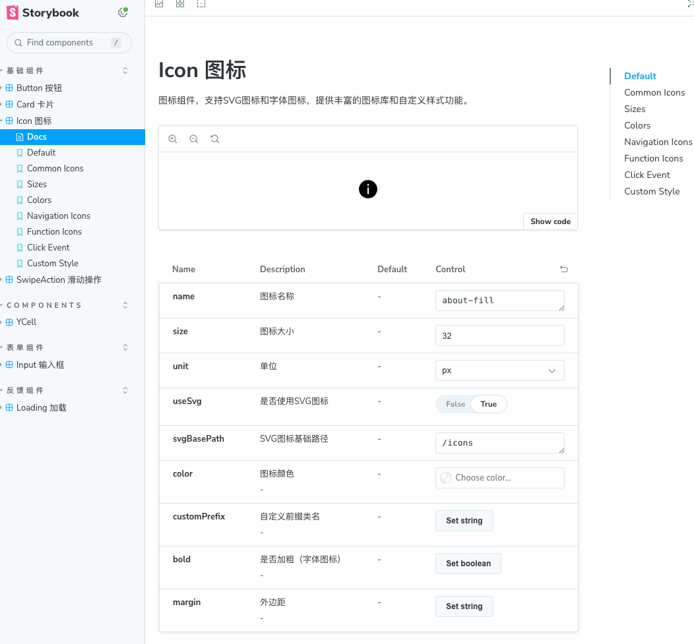

### 🚧 待开发组件

我们计划开发以下组件，欢迎社区贡献者参与：

#### 基础组件
- [ ] YImage - 图片组件
- [ ] YText - 文本组件
- [ ] YDivider - 分割线
- [ ] YBadge - 徽标组件

#### 表单组件
- [ ] YCheckbox - 复选框
- [ ] YSwitch - 开关
- [ ] YSlider - 滑块
- [ ] YRate - 评分
- [ ] YPicker - 选择器
- [ ] YDatePicker - 日期选择器
- [ ] YUpload - 文件上传

#### 反馈组件
- [ ] YToast - 轻提示
- [ ] YActionSheet - 动作面板
- [ ] YDialog - 对话框
- [ ] YNotify - 消息通知
- [ ] YProgress - 进度条

#### 展示组件
- [ ] YCollapse - 折叠面板
- [ ] YSwiper - 轮播图
- [ ] YTimeline - 时间轴

#### 导航组件
- [ ] YNavBar - 导航栏
- [ ] YTabBar - 标签栏
- [ ] YSidebar - 侧边导航
- [ ] YIndexBar - 索引栏
- [ ] YPagination - 分页

#### 业务组件
- [ ] YSearch - 搜索
- [ ] YCalendar - 日历
- [ ] YAddressBook - 通讯录
- [ ] YGoodsAction - 商品导航
- [ ] YSubmitBar - 提交订单栏

## 🏗️ 设计系统架构

You-Web UI 设计系统采用分层架构，从基础的设计令牌到复杂的业务模式，形成完整的设计生态：

### 1️⃣ 基础层 (Foundation Layer)
**设计令牌 (Design Tokens)**
- 颜色令牌：`--color-primary-500`, `--color-neutral-100` 等
- 字体令牌：`--font-size-base`, `--font-weight-medium` 等  
- 间距令牌：`--spacing-xs`, `--spacing-lg` 等
- 动效令牌：`--duration-fast`, `--easing-standard` 等

### 2️⃣ 组件层 (Component Layer)
**原子组件 (Atoms)**
- YButton, YIcon, YInput 等基础组件
- 高度可复用，功能单一

**分子组件 (Molecules)**  
- YCard, YCell, YSwipeAction 等组合组件
- 由多个原子组件组合而成

**有机体组件 (Organisms)**
- YModal, YDrawer, YTabs 等复杂组件
- 具备完整的业务功能

### 3️⃣ 模式层 (Pattern Layer)
**交互模式 (Interaction Patterns)**
- 表单布局模式
- 列表展示模式  
- 数据筛选模式
- 导航结构模式
- 错误处理模式

**业务模式 (Business Patterns)**
- 用户认证流程
- 数据展示模板
- 操作反馈模式

### 4️⃣ 应用层 (Application Layer)
**页面模板 (Page Templates)**
- 基于模式和组件构建的完整页面
- 提供最佳实践示例

### 🔄 设计系统建设思路

1. **明确核心设计原则与价值观** ✅
   - 已建立一致性、高效性、易用性等核心原则
   - 指导所有设计和开发决策

2. **建立设计语言与视觉规范** 🚧
   - 正在完善设计令牌系统
   - 建立可编程的视觉变量体系

3. **完善组件库** 🚧
   - 持续优化现有组件的原子性与组合性
   - 增强无障碍支持和国际化能力
   - 完善主题化系统

4. **定义设计模式** 📋
   - 规划中：建立常见交互模式库
   - 提供业务场景的最佳实践

5. **构建工具生态** 🔮
   - 未来计划：设计令牌管理工具
   - 代码生成工具和设计协作工具

## 📖 文档

- **在线文档**：[Storybook 文档](http://localhost:6006/) (本地开发)
- **组件示例**：[Playground 演示](http://localhost:3000/) (本地开发)

### 本地运行文档

```bash
# 克隆项目
git clone https://github.com/hourong88/You-Web-UI.git
cd You-Web-UI

# 安装依赖
pnpm install

# 启动 Storybook 文档
pnpm --filter @you-web/docs dev

# 启动 Playground 示例
pnpm --filter @you-web/playground dev
```

## 🤝 参与贡献

我们非常欢迎社区的贡献！无论是新组件开发、bug 修复、文档完善还是功能建议，都欢迎提交 PR 或 Issue。

### 贡献指南

1. **Fork 项目**到你的 GitHub 账户
2. **创建特性分支**：`git checkout -b feature/new-component`
3. **提交更改**：`git commit -am 'Add new component'`
4. **推送分支**：`git push origin feature/new-component`
5. **提交 Pull Request**

### 开发环境

```bash
# 安装依赖
pnpm install

# 启动开发服务器
pnpm dev

# 构建组件库
pnpm build

# 运行测试
pnpm test
```

### 组件开发规范

- 使用 Vue 3 Composition API
- 完整的 TypeScript 类型定义
- 遵循统一的命名规范（Y + 组件名）
- 提供完整的 Props 和 Events 文档
- 编写 Storybook 文档和示例
- 确保多端兼容性

## 📄 许可证

[MIT License](./LICENSE)

## 🙏 致谢

感谢所有为这个项目做出贡献的开发者！

## 📞 联系我们

如果你有任何问题或建议，欢迎通过以下方式联系我们：

- 提交 [Issue](https://github.com/hourong88/You-Web-UI/issues)
- 发起 [Discussion](https://github.com/hourong88/You-Web-UI/discussions)

---

⭐ 如果这个项目对你有帮助，请给我们一个 Star！

---

# You-Web UI (English)

🚀 A modern Web component library based on Vue 3 + TypeScript, crafted for Vue developers

## ✨ Features

- 🎯 **Modern Tech Stack**: Built with Vue 3 + TypeScript + Vite
- 📱 **Multi-platform Support**: Supports H5, Mini Programs, Apps and more
- 🎨 **Lightweight & Clean**: Simple component design with small bundle size
- 🔧 **TypeScript**: Complete TypeScript type support
- 📖 **Comprehensive Documentation**: Detailed component docs and examples
- 🎪 **Storybook**: Visual component showcase and debugging
- 🎨 **Design Principles & Values**: Based on consistency, usability, and scalability
- 🎯 **Design Token Driven**: Ensures visual consistency and theming capabilities
- ♿ **Accessibility Support**: Follows WCAG 2.1 standards for accessibility
- 🌍 **Internationalization Ready**: Supports multiple languages and localization
- 🎭 **Theming System**: Flexible theme customization and brand adaptation
- 🧩 **Atomic Design**: Based on atomic design theory for composability and reusability

## 🎉 Project Background

You-Web UI is more than just a component library - it's a complete design system. Our core philosophy is: **A design system is a comprehensive collection of design principles, components, patterns, and tools that ensures consistent and high-quality user experiences across different platforms and scenarios, while improving development and collaboration efficiency.**

### 🎯 Design Principles & Values

Our design system is built on the following core principles:

- **🎨 Consistency**: Unified design language and visual standards ensure consistent user experience across different scenarios
- **⚡ Efficiency**: Out-of-the-box components and patterns significantly improve development efficiency
- **🎯 Usability**: Focus on user experience with intuitive interaction design principles
- **🔧 Scalability**: Flexible architecture design supporting rapid business iteration and expansion
- **♿ Inclusivity**: Following accessibility design standards to ensure equal access for all users
- **🌱 Sustainability**: Considering long-term maintenance and evolution, building a sustainable design ecosystem

### 🎨 Design Token Driven

We use Design Tokens as the foundation of our design system - programmable variables that define all visual elements:

- **🎨 Color System**: Complete color palette including primary, secondary, neutral, and functional colors
- **📝 Typography System**: Hierarchical typography standards for font sizes, weights, and line heights
- **📏 Spacing System**: Unified standards for padding, margins, and component spacing
- **🔘 Shape System**: Consistent definitions for border radius, borders, and shadows
- **🎬 Motion System**: Unified timing curves and durations for transitions and animations
- **🎯 Icon System**: Consistent icon style and usage guidelines

These design tokens ensure visual consistency across platforms and tech stacks while supporting flexible theme customization.

## 📦 Installation

```bash
npm install @you-web/ui-core
# or
pnpm add @you-web/ui-core
# or
yarn add @you-web/ui-core
```

## 🚀 Quick Start

### Global Import

```typescript
import { createApp } from 'vue'
import YouUI from '@you-web/ui-core'
import '@you-web/ui-core/dist/style.css'

const app = createApp(App)
app.use(YouUI)
```

### On-demand Import

```typescript
import { YButton, YCard } from '@you-web/ui-core'
```

### Usage in Template

```vue
<template>
  <YButton type="primary" @click="handleClick">Click Button</YButton>
  <YCard title="Card Title">
    <p>Card content</p>
  </YCard>
</template>
```

## 🎯 Supported Platforms

- ✅ **Modern Browsers**: Perfect support for Chrome, Firefox, Safari, Edge and other mainstream browsers
- ✅ **Mobile Browsers**: Support for mobile H5 applications
- ✅ **Vue 3 Applications**: Optimized for Vue 3 projects
- ✅ **TypeScript**: Complete type support

## 📋 Component List

### ✅ Completed Components

| Component | Description | Status |
|-----------|-------------|--------|
| YButton | Button component | ✅ Completed |
| YCard | Card container | ✅ Completed |
| YCell | Cell component | ✅ Completed |
| YIcon | Icon component | ✅ Completed |
| YInput | Input component | ✅ Completed |
| YList | List component | ✅ Completed |
| YLoading | Loading component | ✅ Completed |
| YSwipeAction | Swipe action | ✅ Completed |
| YTag | Tag component | ✅ Completed |
| YFooter | Footer component | ✅ Completed |
| YGrid | Grid component | ✅ Completed |
| YTips | Tips component | ✅ Completed |
| YSteps | Steps component | ✅ Completed |
| YDrawer | Drawer component | ✅ Completed |
| YModal | Modal component | ✅ Completed |
| YTabs | Tabs component | ✅ Completed |
| YCountdown | Countdown component | ✅ Completed |
| YToast | Toast component | ✅ Completed |
| YCascadeSelection | Cascade selection | ✅ Completed |

### 📸 Component Preview

Here are the effects of components in actual applications:

#### Component Page Overview


#### YCard Component


#### YCell Component


#### YInput Component


#### YLoading Component


#### YSwipeAction Component


#### YDrawer Component


#### YModal Component


#### YTabs Component


#### YCountdown Component


#### YCascadeSelection Component


#### Documentation System


### 🚧 Components in Development

We plan to develop the following components, community contributors are welcome:

#### Basic Components
- [ ] YImage - Image component
- [ ] YText - Text component
- [ ] YDivider - Divider
- [ ] YBadge - Badge component

#### Form Components
- [ ] YRadio - Radio button
- [ ] YCheckbox - Checkbox
- [ ] YSwitch - Switch
- [ ] YSlider - Slider
- [ ] YRate - Rate
- [ ] YPicker - Picker
- [ ] YDatePicker - Date picker
- [ ] YUpload - File upload

#### Feedback Components
- [ ] YToast - Toast
- [ ] YActionSheet - Action sheet
- [ ] YDialog - Dialog
- [ ] YNotify - Notification
- [ ] YProgress - Progress bar

#### Display Components
- [ ] YCollapse - Collapse panel
- [ ] YSwiper - Swiper
- [ ] YTimeline - Timeline

#### Navigation Components
- [ ] YNavBar - Navigation bar
- [ ] YTabBar - Tab bar
- [ ] YSidebar - Sidebar navigation
- [ ] YIndexBar - Index bar
- [ ] YPagination - Pagination

#### Business Components
- [ ] YSearch - Search
- [ ] YCalendar - Calendar
- [ ] YAddressBook - Address book
- [ ] YGoodsAction - Goods action
- [ ] YSubmitBar - Submit bar

## 📖 Documentation

- **Online Documentation**: [Storybook Documentation](http://localhost:6006/) (Local development)
- **Component Examples**: [Playground Demo](http://localhost:3000/) (Local development)

### Running Documentation Locally

```bash
# Clone the project
git clone https://github.com/hourong88/You-Web-UI.git
cd You-Web-UI

# Install dependencies
pnpm install

# Start Storybook documentation
pnpm --filter @you-web/docs dev

# Start Playground examples
pnpm --filter @you-web/playground dev
```

## 🔄 版本管理

### 发布新版本

当您需要发布新版本时，请使用以下命令进行版本管理：

```bash
# 补丁版本（修复bug）
npm version patch

# 次要版本（新功能，向后兼容）
npm version minor

# 主要版本（破坏性更改）
npm version major
```

### 发布流程

```bash
# 1. 构建项目
pnpm build

# 2. 更新版本号
npm version patch  # 或 minor/major

# 3. 发布到 NPM
npm publish --access public

# 4. 推送到 Git
git push origin main --tags
```

### 版本规范

我们遵循 [语义化版本](https://semver.org/lang/zh-CN/) 规范：

- **MAJOR**：不兼容的 API 修改
- **MINOR**：向下兼容的功能性新增
- **PATCH**：向下兼容的问题修正

## 🤝 Contributing

We welcome community contributions! Whether it's new component development, bug fixes, documentation improvements, or feature suggestions, feel free to submit PRs or Issues.

### Contribution Guide

1. **Fork the project** to your GitHub account
2. **Create a feature branch**: `git checkout -b feature/new-component`
3. **Commit changes**: `git commit -am 'Add new component'`
4. **Push branch**: `git push origin feature/new-component`
5. **Submit Pull Request**

### Development Environment

```bash
# Install dependencies
pnpm install

# Start development server
pnpm dev

# Build component library
pnpm build

# Run tests
pnpm test
```

### Component Development Standards

- Use Vue 3 Composition API
- Complete TypeScript type definitions
- Follow unified naming conventions (Y + ComponentName)
- Provide complete Props and Events documentation
- Write Storybook documentation and examples
- Ensure multi-platform compatibility

## 📄 License

[MIT License](./LICENSE)

## 🙏 Acknowledgments

Thanks to all developers who contributed to this project!

## 📞 Contact Us

If you have any questions or suggestions, feel free to contact us through:

- Submit [Issue](https://github.com/hourong88/You-Web-UI/issues)
- Start [Discussion](https://github.com/hourong88/You-Web-UI/discussions)

---

⭐ If this project helps you, please give us a Star!
